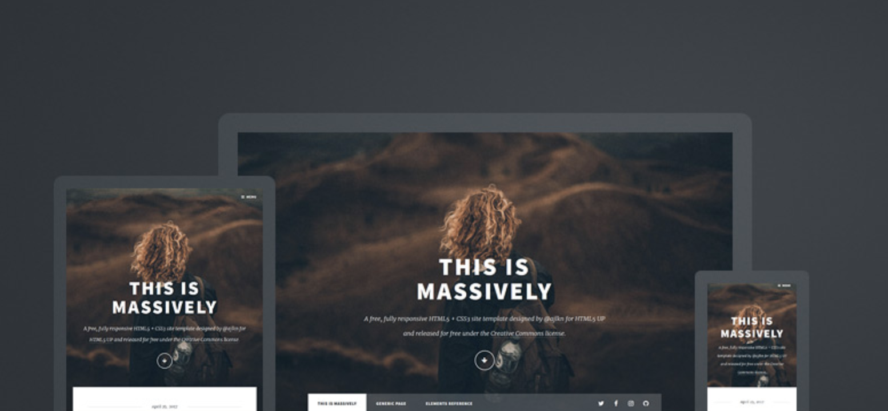

# Hugo Theme Massively

 [](https://github.com/curtiscde/hugo-theme-massively/actions/workflows/e2e.yml)

Massively theme ported from [HTML5 UP](https://html5up.net/) for use with the [Hugo static site generator](https://gohugo.io/).

> **Requires Hugo 0.158.0 or later** (extended edition, for Sass support). Older
> versions will fail to build — see [CHANGELOG](CHANGELOG.md) for the `7.0.0` notes.



## Demo

<https://hugo-theme-massively.netlify.com/>

## Setup

### Configuration

See the demo's configuration as an example:

<https://github.com/curtiscde/hugo-theme-massively/blob/master/exampleSite/hugo-prod.toml>

#### Hugo Embedded Templates

The theme also renders Hugo's [embedded templates](https://gohugo.io/templates/embedded/):

- [Disqus](https://gohugo.io/templates/embedded/#disqus) — configure via `services.disqus.shortname`
- [Google Analytics](https://gohugo.io/templates/embedded/#google-analytics) — configure via `services.googleAnalytics.id`

Because these are now ordinary partials, you can override either of them by adding your
own `layouts/_partials/disqus.html` or `layouts/_partials/google_analytics.html`.

### Cover Image

The cover image URL is hard-coded, therefore to replace this add an image to the following location in your Hugo application:

```
/static/images/bg.jpg
```

### Supported Languages

- [English](https://github.com/curtiscde/hugo-theme-massively/blob/master/i18n/en.toml)
- [Dutch](https://github.com/curtiscde/hugo-theme-massively/blob/master/i18n/nl.toml)
- [French](https://github.com/curtiscde/hugo-theme-massively/blob/master/i18n/fr.toml)
- [Japanese](https://github.com/curtiscde/hugo-theme-massively/blob/master/i18n/ja.toml)
- [Simplified Chinese](https://github.com/curtiscde/hugo-theme-massively/blob/master/i18n/zh.toml)
- [Spanish](https://github.com/curtiscde/hugo-theme-massively/blob/master/i18n/es.toml)

## Custom Front Matter

- `disableComments` - If set to `true` this will disable comments on the post when Disqus is enabled.

## Custom `<head>`

If you wish to add custom CSS overrides, or other elements in the `<head>`, then this can be done by adding the following to the root of your Hugo app: `layouts/_partials/htmlhead-custom.html`. Any content added to this file will then be injected at the end of the `<head>`.

> **Renamed in `7.0.0`.** This file was previously `layouts/partials/htmlhead.custom.html`.
> The dot in the old name is now parsed as a template identifier by Hugo's template
> system, which made the partial resolve to itself. If you were using the old name,
> rename your file to `htmlhead-custom.html`.

## Development

### Example Site Production Deployment

#### Production Deployment

```
cd exampleSite
hugo --config hugo-prod.toml
```

#### Running Locally

```shell
npm i
npm run hugo-dev
```

OR

```shell
cd exampleSite
hugo server --themesDir ../..
```

## Original Theme Credits

- [Massively by HTML5 UP](https://html5up.net/massively)

## License

This hugo theme is licensed under the [Creative Commons Attribution 3.0 License](https://creativecommons.org/licenses/by/3.0/).

Read More - [LICENSE](LICENSE)
